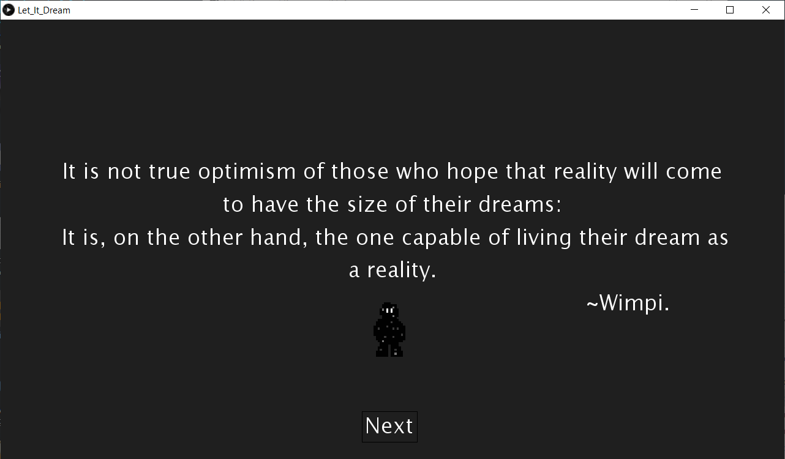
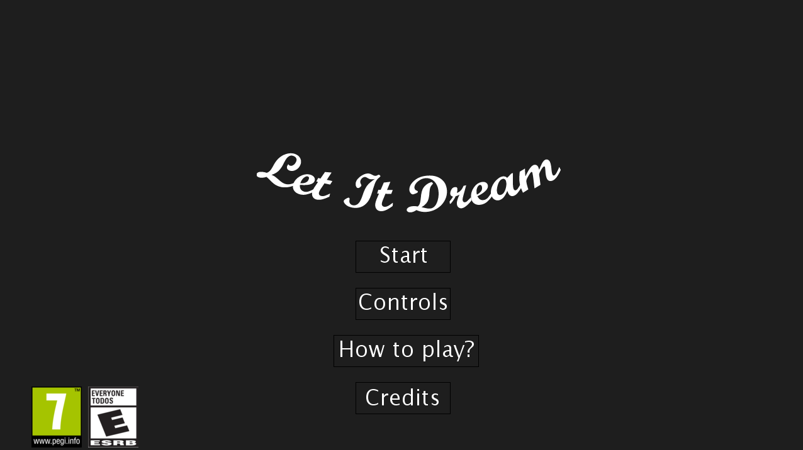

# LET IT DREAM

**Título del juego:** "Let it dream"\
**Autores:** \
-Andrés Leonardo Tarazona Moreno    ---->**Código**:2190411\
-Sergio Sebastián Oliveros Sepulveda---->**Código**:2190396

**Grupo:** D2

**Descripción:**\
Este programa permite jugar al usuario ‘Let it dream’, un videojuego de plataformas donde tú serás el personaje principal, 
iniciarás el juego en un mundo onírico, en el cual serás perseguido por un dragón intimidante, 
el propósito es llegar hasta el final del recorrido sin que te caigas al vacío o el dragón te atrape.
Eres el hacedor de tu propia historia, ¿qué cosas te esperarán en tus peores pesadillas?

**Objetivo:**\
Escapar del dragón y alcanzar el mayor puntaje posible.\
**Propósito:**\
El juego está hecho para que el usuario asocie sus pensamientos con la representación gráfica que se le asignan en el mismo, 
siendo este un mundo capaz de compartir los sueños y los miedos del propio jugador. 
La finalidad de ‘Let it dream’ es buscar el razonamiento del usuario para poder identificar quiénes son realmente esos personajes que está observando y qué representan en su vida. 
En suma, aunque los desarrolladores hayan realizado el juego con cierta perspectiva, dejaron abierta la posibilidad de interpretación para que el jugador se sumerja en un sin fin de posibilidades.  

**Lista de características:**
1. El juego cuenta con una sucesión de pantallas iniciales, las cuales estarán representando brevemente la historia del mismo.
2. La imagen y las frases que aparecen al inicio son parte de la contextualización de la historia del juego. 
3. El menú principal contiene una sección para revisar y probar los controles, la sección de créditos y el botón de START para iniciar el juego.
4. El juego cuenta con su respectiva clasificación, la cual está representada en el menú.
5. La sucesión de pantallas iniciales cuenta con botones nombrados NEXT para poder adelantarlas.  
6. Se eligieron distintos tonos musicales para las diversas situaciones presentadas en el juego. 
7. El personaje pierde si hace contacto con el dragón. 
8. Si el personaje cae al vacío tendrá una nueva oportunidad de pasar el nivel completando el siguiente minijuego: 
el jugador deberá volver a la superficie atravesando una puerta, para esto deberá subir las plataformas correspondientes y evitar que el  ‘fantasma’ que lo persigue lo atrape. 
Cabe aclarar que si el personaje cae al vacío en el minijuego o es atrapado por el ‘fantasma’ pierde definitivamente.
9. El salto del personaje está hecho de tal manera que se convierta en un ente, de esta manera se elevará diagonalmente hasta llegar al máximo alcance,
para luego bajar verticalmente. 
10. El dragón que se muestra en pantalla se mueve hacia arriba y hacia abajo en un bucle infinito, pero si el personaje se acerca a determinada distancia, 
el dragón descenderá o ascenderá (dependiendo del caso) hasta la posición Y del personaje.
11. Todas las plataformas son creaciones propias de Processing, exceptuando las texturas de las plataformas del minijuego.
12. Si el personaje llega al final del nivel y atraviesa el portal, se dará por victorioso, es decir, el jugador ‘despertará’.
13. El puntaje del jugador se muestra al extremo superior derecho de la pantalla, esto dependerá de la cantidad de tiempo que demore en pasar el nivel, 
mientras menos se demore más puntaje obtendrá. Además, cada vez que el personaje deba realizar el minijuego se le descontarán puntos. 

**Género:**\
Videojuego de plataformas.

**Clasificación por edades:**\

**Juego realizado en:**\
-Processing 3.5.4.\
**Requisitos:**\
-Libreria 'Sprites', realizada por Peter Lager.\
-Libreria 'Minim', realizada por Damien Di Fede y Anderson Mills.

# **Imágenes del videojuego:**
**Pantalla inicial:**\
El juego inicia de la siguiente manera:  

Luego de esto, el jugador será contextualizado por otra serie de imágenes y frases, dándose a conocer el objetivo principal del juego. \
**Menú principal:**\
El menú principal estará compuesto de 4 secciones: 'Start', 'Controls, 'How to play?' y 'Credits'. Además se representará el título del juego y su respectiva clasificación. \

# **Créditos:**
Todos los ‘Sprites’ de este videojuego fueron realizados por los autores.\
La imagen del fantasma fue inspirada en el Pokemón Haunter, tomada de:\
-© 2020 Pokémon. © 1995–2020 Nintendo / Creatures Inc.\

**Música extraída de:**\
-Joji-Misery (SoundCloud)\
-Creador de BGM (Youtube)\
-Rain and Thunder (Youtube)\
-Broforce Soundtrack-End Of The Line\

**README realizado en:**\
-LET IT DREAM created by GitHub Classroom.
