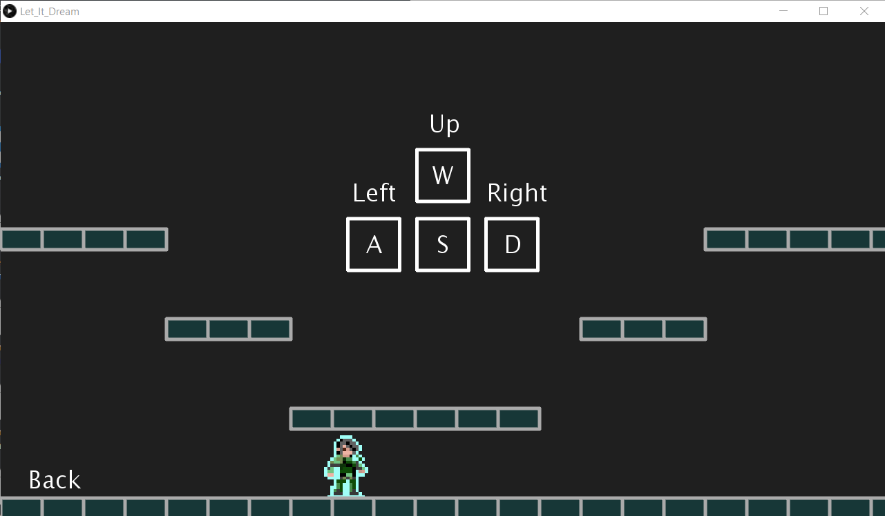

# LET IT DREAM

**Title of the game:** "Let it dream"\
**Authors:** \
-Andrés Leonardo Tarazona Moreno    ---->**Code**:2190411\
-Sergio Sebastián Oliveros Sepulveda---->**Code**:2190396

**Group:** D2

**Description:**\
This program allows you to play Group:Let it dream', a platform video game where you will be the main character, you will start the game in a dream world, in which you will be chased by an intimidating dragon, The purpose is to reach the end of the tour without you falling into the void or the dragon catching you. You are the maker of your own story, what things will await you in your worst nightmares?

**Objective:**\
Escape the dragon and reach the finish line.\
**Purpose:**\
The game is made for the user to associate his thoughts with the graphic representation assigned to him in it, this being a world capable of sharing the dreams and fears of the player himself. The purpose of ³Let it dream' is to find the user’s reasoning to identify who these characters are and what they represent in their lives. In short, although the developers have made the game with some perspective, they left open the possibility of interpretation for the player to dive into endless possibilities. 

**List of features:**
1. The game features a succession of initial screens, which will briefly represent the story of the game.
2. The sequence of initial screens has buttons named NEXT to be able to advance them.  
3. Different musical tones were chosen for the different situations presented in the game. 
4. The character loses if he makes contact with the dragon. 
5. If the character falls to the void you will have a new opportunity to pass the level by completing the next minigame, where you will have to escape through the door:  

6. Along the way there will be signs indicating what kind of destination awaits the player, you should be aware.
7. The jump of the character is done in such a way that it becomes an entity, in this way it will rise diagonally until reaching the maximum range, and then descend vertically. 
8. The dragon shown on the screen moves up and down in an infinite loop, but if the character approaches at a certain distance, the dragon will descend or ascend (depending on the case) to the Y position of the character. \

9. All platforms are Processing’s own creations, except for the textures of the minigame platforms.
10. If the character reaches the end of the level and crosses the portal, he will be victorious, that is, the player will wake up. 

**Gender:**\
 Platform video game.

**Classification by age:**\

**Game made in:**\
-Processing 3.5.4.\
**Requirements:**\
-Bookshop 'Sprites' by Peter Lager.\
-Libreria 'Minim' by Damien Di Fede and Anderson Mills.

# **Descriptive images of the video game:**
**Home screen:**\
The game starts as follows:  

After this, the player will be contextualized by another series of images and phrases, revealing the main objective of the game. \
**Main menu:**\
The main menu will consist of 4 sections: 'Start', 'Controls, 'How to play? ' and 'Credits'. It will also represent the title of the game and its respective ranking. \

**Controls:**\
Here you can move freely to learn to play and be prepared:

The rest we leave to your hands: inspect, think, learn and enjoy.

# **Credits:**
All the 'Sprites' of this video game were made by the authors.\
The image of the ghost was inspired by the Pokemon Haunter, taken from:\
-© 2020 Pokémon. © 1995–2020 Nintendo / Creatures Inc.\

**Music taken from:**\
-Joji-Misery (SoundCloud)\
-Creator of BGM (Youtube)\
-Rain and Thunder (Youtube)\
-Broforce Soundtrack-End Of The Line\

**README made in:**\
-LET IT DREAM created by GitHub Classroom.

